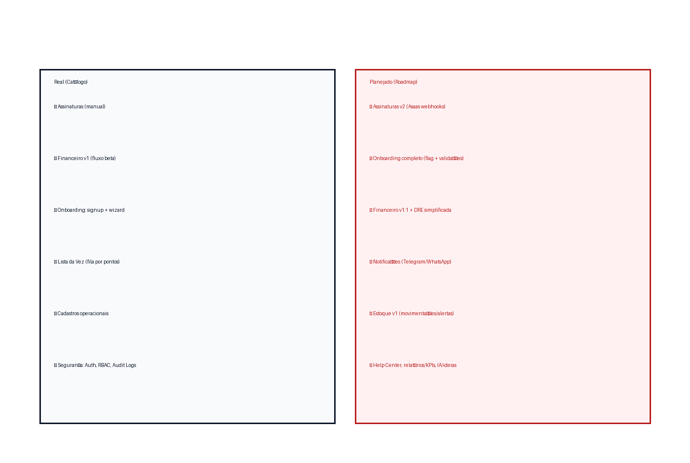

> Atualizado em: 22/11/2025 18:30 (America/Sao_Paulo)
> 🎉 **ATUALIZAÇÃO:** Novos módulos Metas, Precificação e Financeiro v2

# Catálogo de Funcionalidades (Produção)

## Visão Geral

Fotografia das funcionalidades **já entregues em produção** (ou em beta interno). Use este catálogo para validar escopo com times de produto/engenharia antes de prometer novas entregas.

**Última Atualização:** 22/11/2025 - Implementação de 44 novos endpoints backend

## Módulos e Funcionalidades

### 🆕 Módulo: Metas (Backend Completo - 22/11/2025)

Baseado em implementação vertical slice (ver `VERTICAL_SLICE_ALL_MODULES.md`).

| Funcionalidade        | Descrição curta                                   | Telas / Rotas principais                  | Status              | Observações                      |
| --------------------- | ------------------------------------------------- | ----------------------------------------- | ------------------- | -------------------------------- |
| Metas Mensais         | CRUD completo de metas mensais do estabelecimento | `POST/GET/PUT/DELETE /metas/mensal`       | ✅ Backend completo | 5 endpoints; frontend pendente   |
| Metas por Barbeiro    | CRUD de metas individuais por profissional        | `POST/GET/PUT/DELETE /metas/barbeiro`     | ✅ Backend completo | 5 endpoints; filtro por barbeiro |
| Metas de Ticket Médio | CRUD de metas de ticket médio                     | `POST/GET/PUT/DELETE /metas/ticket-medio` | ✅ Backend completo | 5 endpoints; multi-tenant        |

**Total:** 15 endpoints backend implementados ✅

### 🆕 Módulo: Precificação (Backend Completo - 22/11/2025)

Sistema de simulação de preços e configurações de margem.

| Funcionalidade               | Descrição curta                                | Telas / Rotas principais                              | Status              | Observações             |
| ---------------------------- | ---------------------------------------------- | ----------------------------------------------------- | ------------------- | ----------------------- |
| Configuração de Precificação | CRUD de configs (margem, custos fixos, markup) | `POST/GET/PUT/DELETE /precificacao/config`            | ✅ Backend completo | 4 endpoints; validações |
| Simulações de Preço          | Simulação + persistência de cenários           | `POST /precificacao/simulacao/simulate`, `/save`, etc | ✅ Backend completo | 5 endpoints; histórico  |

**Total:** 9 endpoints backend implementados ✅

### 🆕 Módulo: Financeiro v2 (Backend Completo - 22/11/2025)

Expansão do módulo financeiro com contas a pagar/receber, compensação, DRE.

| Funcionalidade                    | Descrição curta                           | Telas / Rotas principais                         | Status              | Observações                    |
| --------------------------------- | ----------------------------------------- | ------------------------------------------------ | ------------------- | ------------------------------ |
| Contas a Pagar                    | CRUD completo + marcar pagamento          | `POST/GET/PUT/DELETE /financeiro/contas-pagar`   | ✅ Backend completo | 6 endpoints; status/vencimento |
| Contas a Receber                  | CRUD completo + marcar recebimento        | `POST/GET/PUT/DELETE /financeiro/contas-receber` | ✅ Backend completo | 6 endpoints; multi-tenant      |
| Compensação Bancária              | Consulta e gestão de compensações         | `GET/List/DELETE /financeiro/compensacao`        | ✅ Backend completo | 3 endpoints                    |
| Fluxo de Caixa                    | Geração e consulta de fluxo diário/mensal | `GET/List /financeiro/fluxo-caixa`               | ✅ Backend completo | 2 endpoints                    |
| DRE (Demonstrativo de Resultados) | Geração e consulta de DRE                 | `GET/:month, List /financeiro/dre`               | ✅ Backend completo | 2 endpoints                    |
| Cronjob Fluxo Diário              | Geração automática de fluxo diário        | Endpoint interno cronjob                         | ✅ Backend completo | 1 endpoint                     |

**Total:** 20 endpoints backend implementados ✅

### Módulo: Assinaturas

Baseado em `ASSINATURAS.md` (modelagem) e `MANUAL_SUBSCRIPTION_FLOW.md` (fluxo manual atual).

| Funcionalidade               | Descrição curta                                                                               | Telas / Rotas principais                 | Status      | Observações                                            |
| ---------------------------- | --------------------------------------------------------------------------------------------- | ---------------------------------------- | ----------- | ------------------------------------------------------ |
| Cadastro de planos           | Criação de planos recorrentes com nome, descrição, valor e periodicidade                      | `/assinaturas/planos`                    | Em produção | Fluxo manual, sem gateway                              |
| Criação de assinatura manual | Associa barbeiro a um plano com datas de início e fatura                                      | `/assinaturas`                           | Em produção | `origem_dado = manual`, status inicial ATIVA           |
| Geração de faturas           | Cron `ValidateSubscriptions` gera automaticamente faturas pendentes; também há geração manual | Cron 02:00 + `/assinaturas/{id}/faturas` | Em produção | Calcula `proxima_fatura_data`; sem cobrança automática |
| Registro de pagamento        | Registro manual de pagamentos e atualização de status da fatura                               | `/assinaturas/{id}/faturas`              | Em produção | Reconciliação manual (sem webhooks Asaas)              |
| Alertas de vencimento        | Alertas internos para faturas vencidas ou próximas                                            | App (toast)                              | Beta        | Integração externa de cobrança ainda não aplicada      |

### Módulo: Financeiro v1 (Legado)

Baseado em `FINANCEIRO.md`. **Nota:** Sendo substituído pelo Financeiro v2 acima.

| Funcionalidade         | Descrição curta                                                         | Telas / Rotas principais  | Status           | Observações                |
| ---------------------- | ----------------------------------------------------------------------- | ------------------------- | ---------------- | -------------------------- |
| Receitas CRUD          | Cadastro/edição de receitas com categoria, método de pagamento e status | `/financeiro/receitas`    | 🟡 Em manutenção | Migrar para v2             |
| Despesas CRUD          | Cadastro/edição de despesas com fornecedor e método de pagamento        | `/financeiro/despesas`    | 🟡 Em manutenção | Migrar para v2             |
| Categorias e métodos   | Gestão de categorias (receita/despesa) e métodos de pagamento           | `/financeiro/categorias`  | ✅ Em produção   | Value Objects              |
| Fluxo de caixa         | Visão consolidada por período (entradas, saídas, saldo)                 | `/financeiro/fluxo-caixa` | ⚠️ Deprecated    | Usar v2 (FluxoCaixa + DRE) |
| Integração assinaturas | Receita proveniente de faturas de assinaturas                           | `/financeiro/receitas`    | Beta             | Alimentação manual         |

### Módulo: Onboarding

Baseado em `ONBOARDING_FLOW_REVIEW.md`, `ONBOARDING_WIZARD_IMPLEMENTATION.md` e `PLANO_CONTINUACAO_ONBOARDING.md`.

| Funcionalidade              | Descrição curta                                              | Telas / Rotas principais       | Status               | Observações                                 |
| --------------------------- | ------------------------------------------------------------ | ------------------------------ | -------------------- | ------------------------------------------- |
| Signup multi-tenant         | Criação de tenant + usuário owner com login automático (JWT) | `POST /auth/signup`            | ✅ Em produção       | Campos validados, JWT RS256                 |
| Wizard de onboarding        | Fluxo multi-etapas (bem-vindo → checklist → concluir)        | `/onboarding`                  | ✅ Em produção       | Hook `useCompleteOnboarding`, UI responsiva |
| Marcar onboarding concluído | Registro do flag `onboarding_completed` para o tenant        | `/tenants/onboarding/complete` | ✅ Concluído (20/11) | Endpoint implementado e testado             |

### Módulo: Lista da Vez (Fila de Barbeiros)

Baseado em `listadavez.md`.

| Funcionalidade           | Descrição curta                                                   | Telas / Rotas principais | Status      | Observações                              |
| ------------------------ | ----------------------------------------------------------------- | ------------------------ | ----------- | ---------------------------------------- |
| Fila rotativa por pontos | Ordenação automática por `current_points`, `last_turn_at`, nome   | `/lista-da-vez`          | Beta        | Barbeiro com menos pontos atende próximo |
| Registro de atendimento  | Incremento de pontos, atualização de `last_turn_at` e reordenação | `/lista-da-vez/atender`  | Beta        | Persistência por tenant                  |
| Inicialização da fila    | Criação inicial de fila com barbeiros ativos (0 pontos)           | `/lista-da-vez`          | Em produção | Ordenação inicial por data de cadastro   |

### Módulo: Cadastros Operacionais

Origem: catálogos citados no catálogo anterior.

| Funcionalidade                | Descrição curta                                | Telas / Rotas principais    | Status      | Observações                           |
| ----------------------------- | ---------------------------------------------- | --------------------------- | ----------- | ------------------------------------- |
| Cadastro de clientes          | CRUD de clientes                               | `/clientes`                 | Em produção |                                       |
| Cadastro de profissionais     | CRUD de barbeiros/profissionais                | `/profissionais`            | Em produção | Usado pela Lista da Vez               |
| Cadastro de serviços/produtos | CRUD de serviços vendidos e itens de apoio     | `/servicos`, `/produtos`    | Em produção | Base para financeiro e estoque futuro |
| Meios de pagamento e cupons   | Catálogo de meios de pagamento e cupons/regras | `/configuracoes/pagamentos` | Em produção | Alimenta financeiro/assinaturas       |

### Identidade e Segurança

Baseado em `RBAC.md`, `SECURITY_TESTING.md`, `AUDIT_LOGS.md`.

| Funcionalidade  | Descrição curta                    | Telas / Rotas principais | Status      | Observações                        |
| --------------- | ---------------------------------- | ------------------------ | ----------- | ---------------------------------- |
| Auth JWT RS256  | Login/signup com tokens assinados  | `/auth/*`                | Em produção | Chaves RSA; expiração configurável |
| RBAC por tenant | Perfis e permissões por role       | Global                   | Em produção | Owners/Managers/Barbers            |
| Audit Logs      | Registro de ações críticas (CRUD)  | Backend                  | Em produção | Persistência multi-tenant          |
| Rate limiting   | Proteção básica em rotas sensíveis | Edge/API                 | Beta        | Ajuste fino planejado              |

## Referências Rápidas

- **Novos Módulos (22/11):** `/Tarefas/01-BLOQUEIOS-BASE/VERTICAL_SLICE_ALL_MODULES.md`
- **Backend Guide:** `docs/04-backend/GUIA_DEV_BACKEND.md` (v2.0)
- `ASSINATURAS.md`, `MANUAL_SUBSCRIPTION_FLOW.md`
- `FINANCEIRO.md` (v1 - ver docs para v2)
- `ONBOARDING_FLOW_REVIEW.md`, `ONBOARDING_WIZARD_IMPLEMENTATION.md`, `PLANO_CONTINUACAO_ONBOARDING.md`
- `listadavez.md`
- `RBAC.md`, `AUDIT_LOGS.md`, `SECURITY_TESTING.md`

## Sumário de Implementação Backend (22/11/2025)

**Total de Endpoints:** 78 funcionais

**Novos (22/11):** 44 endpoints

- Metas: 15 endpoints
- Precificação: 9 endpoints
- Financeiro v2: 20 endpoints

**Status Compilação:** ✅ 100% success

**Arquitetura:** Clean Architecture + Multi-tenancy preservados

**Próximos Passos:**

1. Frontend para novos módulos
2. Testes automatizados (unit + integration + e2e)
3. Documentação de API atualizada
